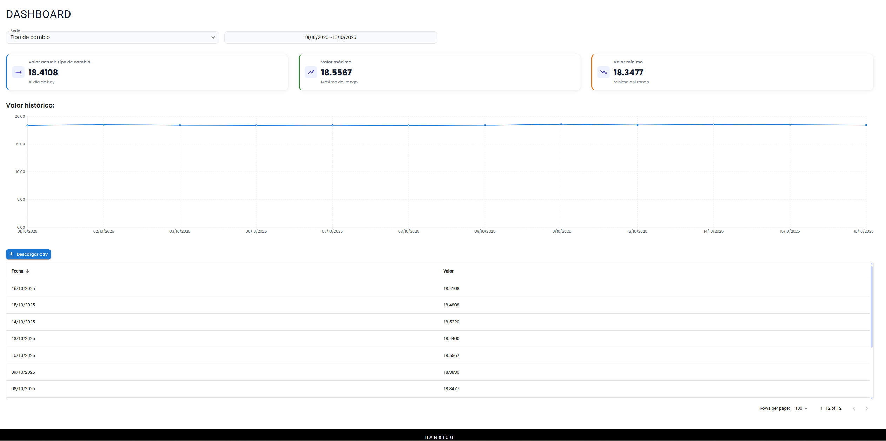

# Banxico Frontend

Aplicación React + TypeScript + Vite con Material UI.

# Aplicacion hosteada en aws Amplify
La aplicacion se encuentra hosteada utilizando el servicio aws Amplify.

## Requisitos
- Node.js 18+ (recomendado) y npm.
- Clonar este repositorio, el repositorio es publico.

## Instalación
```bash
npm i
```

## Ejecutar en desarrollo
```bash
npm run dev
```
Abrirá el proyecto en Vite (por defecto en http://localhost:5173).

## Compilar para producción
```bash
npm run build
```
Los artefactos se generan en la carpeta `dist/`.

## Previsualizar build de producción
```bash
npm run preview
```

## Linter
```bash
npm run lint
```

## Estructura relevante
- `src/components/` contiene carpetas por componente y un `index.ts` para exportarlos.
- `src/views/` contiene las vistas (por ejemplo `Dashboard/`).
- `src/services/` contiene clientes/servicios HTTP (`banxicoApi.ts`).

## Variables/Configuración
La variable de entorno `Bmx-Token` se debe agregar en el archivo `.env`.
NOTA: Se creo una api en aws para consumir la api de banxico, ya que la api de banxico no permite consumirla desde el frontend cuando se hace el build por temas de cors, por ello se creo una api en aws para consumir la api de banxico y actua como intermediario, dicho endpoint consume la api de banxico, utiliza el token de la api de banxico para autenticar la peticion y retorna los datos en formato json.

## Vistas

### Dashboard


### Responsiva


## React Compiler

The React Compiler is not enabled on this template because of its impact on dev & build performances. To add it, see [this documentation](https://react.dev/learn/react-compiler/installation).

## Expanding the ESLint configuration

If you are developing a production application, we recommend updating the configuration to enable type-aware lint rules:

```js
export default defineConfig([
  globalIgnores(['dist']),
  {
    files: ['**/*.{ts,tsx}'],
    extends: [
      // Other configs...

      // Remove tseslint.configs.recommended and replace with this
      tseslint.configs.recommendedTypeChecked,
      // Alternatively, use this for stricter rules
      tseslint.configs.strictTypeChecked,
      // Optionally, add this for stylistic rules
      tseslint.configs.stylisticTypeChecked,

      // Other configs...
    ],
    languageOptions: {
      parserOptions: {
        project: ['./tsconfig.node.json', './tsconfig.app.json'],
        tsconfigRootDir: import.meta.dirname,
      },
      // other options...
    },
  },
])
```

You can also install [eslint-plugin-react-x](https://github.com/Rel1cx/eslint-react/tree/main/packages/plugins/eslint-plugin-react-x) and [eslint-plugin-react-dom](https://github.com/Rel1cx/eslint-react/tree/main/packages/plugins/eslint-plugin-react-dom) for React-specific lint rules:

```js
// eslint.config.js
import reactX from 'eslint-plugin-react-x'
import reactDom from 'eslint-plugin-react-dom'

export default defineConfig([
  globalIgnores(['dist']),
  {
    files: ['**/*.{ts,tsx}'],
    extends: [
      // Other configs...
      // Enable lint rules for React
      reactX.configs['recommended-typescript'],
      // Enable lint rules for React DOM
      reactDom.configs.recommended,
    ],
    languageOptions: {
      parserOptions: {
        project: ['./tsconfig.node.json', './tsconfig.app.json'],
        tsconfigRootDir: import.meta.dirname,
      },
      // other options...
    },
  },
])
```
